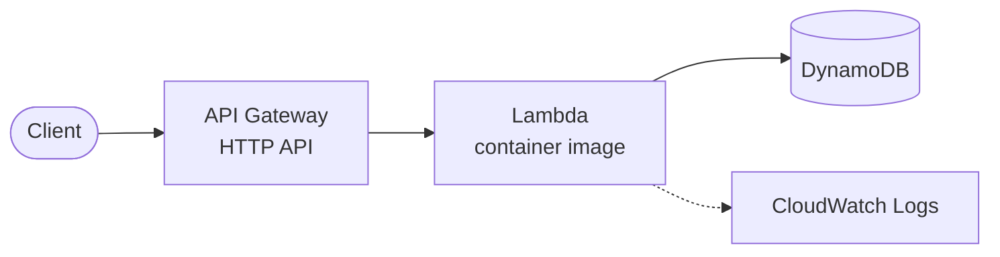

# aws-serverless-fastapi

A URL shortener built with FastAPI, packaged as a container image, and deployed on AWS Lambda behind API Gateway with the Serverless Framework.

This is one half of a pair. [`fastapi-aws-ecs-fargate`](https://github.com/jesusroncal94/fastapi-aws-ecs-fargate) runs the **same API, with the same domain layer**, on ECS Fargate with PostgreSQL. Reading them side by side isolates a single variable: what changes when the runtime model changes, and what does not have to.

## The API

| Method | Path            | Description                                   |
| ------ | --------------- | --------------------------------------------- |
| `POST` | `/links`        | Shortens a URL and returns its code            |
| `GET`  | `/{code}`       | Redirects to the target and records the visit  |
| `GET`  | `/links/{code}` | Returns the target URL and the visit count     |
| `GET`  | `/health`       | Liveness probe                                 |

## Architecture



There is nothing to keep running and nothing to scale. The function is the unit of deployment, and DynamoDB bills per request alongside it.

## What the two repositories share, and what they don't

`src/shortener/domain/` is **byte-for-byte identical** in both. It declares the `LinkRepository` protocol it needs and receives an implementation through the constructor, so the use cases never learn where a link is stored.

Everything below the line is what actually had to change:

| | ECS Fargate | Lambda |
| --- | --- | --- |
| Storage | PostgreSQL via SQLAlchemy | DynamoDB via aioboto3 |
| Counting a visit | `SELECT` then `UPDATE` in a transaction | one atomic `UpdateItem` |
| Absent record | `NULL` row | `ConditionalCheckFailedException` |
| Entry point | `uvicorn` process | `Mangum` adapter |
| Packaging | multi-stage image, non-root user | image on the Lambda base |
| Scaling | task count and a load balancer | per-request, to zero |
| Idle cost | load balancer and database run continuously | nothing |

The repository implementation is a single file in each project: [`sql_link_repository.py`](https://github.com/jesusroncal94/fastapi-aws-ecs-fargate/blob/main/src/shortener/infrastructure/sql_link_repository.py) there, [`dynamodb_link_repository.py`](src/shortener/infrastructure/dynamodb_link_repository.py) here. That is the whole cost of the move.

## Running it locally

```bash
docker compose up --build
```

This starts the API against [DynamoDB Local](https://docs.aws.amazon.com/amazondynamodb/latest/developerguide/DynamoDBLocal.html), creating the table on first boot. The API listens on <http://localhost:8000>; set `API_PORT` and `BASE_URL` to move it.

```bash
curl -X POST http://localhost:8000/links -H 'Content-Type: application/json' -d '{"target_url":"https://aws.amazon.com/lambda/"}'
```

## Running the tests

```bash
docker compose --profile test run --rm tests
```

The suite drives the API through an in-memory `LinkRepository` defined in [`tests/doubles.py`](tests/doubles.py) — the same protocol DynamoDB implements. No emulator, no credentials, no network.

## Exercising the real Lambda image

The tests above never touch the deployment artifact. To invoke the actual image the way Lambda will, use the runtime emulator that ships in the AWS base image:

```bash
docker build --target lambda -t shortener-lambda .
docker run --rm -p 9000:8080 --network aws-serverless-fastapi_default \
  -e TABLE_NAME=links -e DYNAMODB_ENDPOINT_URL=http://dynamodb:8000 \
  -e AWS_ACCESS_KEY_ID=local -e AWS_SECRET_ACCESS_KEY=local \
  shortener-lambda
```

Then POST an API Gateway HTTP API v2 event to it:

```bash
curl -XPOST "http://localhost:9000/2015-03-31/functions/function/invocations" -d @event.json
```

The response is the raw Lambda payload — `statusCode`, `headers`, `body` — rather than an HTTP response, which is a useful reminder of what Mangum is actually translating.

## Deploying

Requires Node.js for the Serverless Framework CLI and AWS credentials with permission to create Lambda, API Gateway, DynamoDB, ECR, and IAM resources.

```bash
npx serverless deploy --stage prod --region us-east-1
```

The framework builds the image from this `Dockerfile`, pushes it to a managed ECR repository, creates the DynamoDB table, and wires the HTTP API. The public URL is printed when it finishes.

```bash
npx serverless remove --stage prod
```

> Serverless Framework v4 requires a free account and `serverless login` for individual use. If you would rather avoid that, the same stack maps cleanly onto AWS SAM.

## Deliberate simplifications

- **`BASE_URL` is derived from the incoming request** rather than configured. Wiring the API Gateway URL into the function's environment creates a circular CloudFormation dependency, and the `Host` header already carries what the response needs.
- **Short codes are random, not sequential.** Seven characters from a 62-symbol alphabet, with a conditional write that retries on the improbable collision. A counter would be shorter but needs coordination that DynamoDB would rather not give.
- **No custom domain or HTTPS certificate**, since both require a registered domain.
- **Point-in-time recovery is on, backups are not configured.** Enough to undo a mistake, not a retention policy.

## License

MIT — see [LICENSE](LICENSE).
